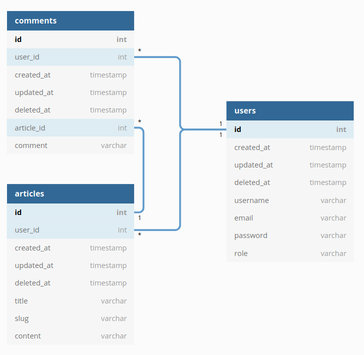

# MT2022_PROJ01_WIKI

*Camille Arsac, Rémi Coufourier, Florian Leroy et Steven Nativel*

<a name="description"/>

## 1 - Description du projet

Une API qui gère des wikis. On peut se connecter/déconnecter, créer un compte, créer des articles, les modifier, les supprimer et ajouter des commentaires, les modifier, les supprimer.

### Table de contenu

* [1. Description](#description)
   * [1.1 Pré requis](#required)
   * [1.2 Lancement du projet](#launch)
* [2. Requêtes](#request)
* [3. Article](#article)
   * [3.1 Création d'un article](#createarticle)
   * [3.2 Mise a jour d'un article](#updatearticle)
   * [3.3 Récupération d'un article](#fetcharticle)
   * [3.4 Récupération des articles](#fetchallarticle)
   * [3.5 Suppression d'un article](#deletearticle)
* [4. Commentaire](#comment)
    * [4.1 Création d'un commentaire](#createcomment)
    * [4.2 Récupération des commentaires liés à un article](#showcomments)
    * [4.3 Mise a jour d'un commentaire](#updatecomment)
    * [4.4 Suppression d'un commentaire](#deletecomment)
* [5. Utilisateur](#user)
    * [5.1 Creation d'un utilisateur](#createuser)
    * [5.2 Récupération d'un utilisateur](#fetchuser)
    * [5.3 Récupération des utilisateurs](#fetchalluser)
    * [5.4 Connexion utilisateur](#auth)
    * [5.5 Déconnexion utilisateur](#logout)
* [5. Modèle de données ](#models)
    

<a name="required"/>

### Pré requis

**Installation des dépendances**
```
go mod vendor
```
Documentation annexe : [JWT](/doc/JWT-explain.md)

<a name="launch"/>

**Setup du .env**
1. Creér une fichier .env a la racine du projet
2. Copier-Coller le contenu du.env.exemple dans ce fichier
3. Remplacer les variables en fonction de votre Environnement
    - La CSRFKey sera utilisé dans les headers des requêtes aillant besoin d'une authentification
  

## Lancement du projet 
```
go run main.go
```


<a name="request"/>

# Requêtes

***Pour toutes les requêtes nécessitant une authentification il sera necessaire d'intégrer a la requête un Header***

```js
X-CSRF-Token : <csrfkey> 
```


| Méthodes | Endpoint | Action  | Authentification|
|---|---|---|---|
| POST | article/create | Création d'un article |Member|
| PUT | article/{slug} | Mise à jour d'un article | Member|
| GET | article/{slug} | Récupération d'un article ||
|GET | articles | Récupération des articles ||
|DELETE | article/{slug} | Suppression d'un article |Member|


| Méthodes | Endpoint | Action | Authentification |
|---|---|---|---|
|POST| comment/create | Création d'un commentaire |Member|
|GET| comment/{articleId} | Récupération des commentaires d'un article|Member|
| PUT | comment/{id} | Mise à jour d'un commentaire |Member|
|DELETE| comment/{id} | Suppression d'un commentaire|Member|

| Méthodes | Endpoint | Action | Authentification |
|---|---|---|---|
|POST| user/create | Création d'un utilisateur ||
|GET| user/{id} | Récupération d'un utilisateur |Admin|
|GET| users | Récupération des utilisateurs |Admin|
|POST| user/login | Connexion utilisateur ||
|POST| user/logout | Déconnexion utilisateur |Member|

<a name="article"/>


# Article

<a name="createarticle"/>

## Création d'un article 

**POST** - Création d'un article

#### Parameters

| Name | Type |Description|
|---|---|---|
|title| string| Titre de l'article |
|content| string| Contenu de l'article |

#### Request URL

```
http://localhost:8080/article/create
```

#### Request Body
```json
{
    "Title": "Vache",
    "Content":"Vache est le nom vernaculaire donné à la femelle du mammifère domestique de l'espèce Bos taurus, un ruminant appartenant à la famille des bovidés, généralement porteur de deux cornes sur le front. Les individus mâles sont appelés taureaux et les jeunes, veaux. Une génisse ou vachette, appelée aussi taure au Québec ou dans le Poitou, est une vache qui n'a pas vêlé. Descendant de plusieurs sous-espèces d'aurochs, les bovins actuels (zébus compris) sont élevés pour produire du lait et de la viande, ou comme animaux de trait. En Inde, la vache est sacrée. Le mot vache vient du latin vacca, de même sens."
}
```
#### Request Response
```json
null
```

<a name="updatearticle"/>

## Mise à jour d'un article

**PUT** - Mise à jour d'un article

#### Parameters

| Name | Type |Description|
|---|---|---|
|title| string| Titre de l'article |
|content| string| Contenu de l'article |

#### Request Url
```
http://localhost:8080/article/{slug}
```

#### Request Body
```json
{
    "Title": "Vache épisode 2",
    "Content":"Le retour de la vache episode deux on update l'article Vache est le nom donné à la femelle du mammifère domestique de l'espèce Bos taurus, un ruminant appartenant à la famille des bovidés, généralement porteur de deux cornes sur le front. Les individus mâles sont appelés taureaux et les jeunes, veaux. Une génisse ou vachette, appelée aussi taure au Québec ou dans le Poitou, est une vache qui n'a pas vêlé. Descendant de plusieurs sous-espèces d'aurochs, les bovins actuels (zébus compris) sont élevés pour produire du lait et de la viande, ou comme animaux de trait. En Inde, la vache est sacrée. Le mot vache vient du latin vacca, de même sens."
}
```
#### Request Response
```json
null
```
<a name="fetcharticle"/>

## Récupération d'un article

**GET** - Récupérer un article

#### Request Url
```
http://localhost:8080/article/{slug}
```
#### Request Response
```json
{
    "ID": 1,
    "CreatedAt": "2021-02-15T22:25:34+01:00",
    "UpdatedAt": "2021-02-15T22:25:37+01:00",
    "DeletedAt": null,
    "UserId": 1,
    "User": {
        "CreatedAt": "2021-02-10T18:06:521+01:00",
        "UpdatedAt": "2021-02-10T18:06:521+01:00",
        "DeletedAt": null,
        "ID": 1,
        "Name": "roger",
        "Email": "roger@gmail.com",
        "Password": "$2a$10$dNM6L5qEVM0vLMQ/0qg4.Og8LA0p36XYXJIUtZp1bw5z7UMR0aLHq"
    },
    "Title": "J'aime les chats",
    "Content": "La civilisation aztèque est une civilisation d’Amérique Centrale basée dans la vallée de Mexico dès le début du XIVème siècle. Les Aztèques seront délogés par les conquistadors aux alentours de 1519. Entre-temps, ils avaient eu le temps d’atteindre un des niveaux de civilisation les plus avancés d’Amérique. Tout comme chez les Mayas, le système de croyances aztèque imposait des sacrifices humains pour les dieux. Apprenez-en plus grâce à cet article.\nPourquoi les Aztèques pratiquaient les sacrifices humains ?\n\nLes Aztèques pensaient que le sang humain était la principale nourriture des dieux, ainsi il était pour eux, tout à fait normal de pratiquer le sacrifice humain afin de s’attirer les bonnes grâces des divinités. Si les sacrifices humains avaient une fonction religieuse dans la civilisation aztèque, ils avaient également une fonction politique.\nLes sacrifices humains et la religion aztèques\n\nD’après les croyances aztèques, les sacrifices humains étaient des éléments indispensables au bon fonctionnement et à l’équilibre de l’univers. La première référence à ces pratiques se trouve dans le mythe de la création du monde. Dans celui-ci, la déesse-terre, Tlaltecuhtli, exige des sacrifices humains et refuse même d’apporter ses bienfaits à moins d’être arrosée de sang. Par la suite, deux dieux, Nanahuatzin et Tecciztecatl sont sacrifiés pour pouvoir renaître sous la forme du Soleil et de la Lune. D’autres sacrifices sont indispensables pour que le Soleil entame sa course autour de la Terre.\n\nDans la Légende des soleils, on raconte que la déesse-Terre avait donné naissance à 400 Mimixcoas, un type de dieu, et à 5 Mecitin, c’est-à-dire des humains. Tandis que les dieux s’adonnaient régulièrement à la luxure et à la fête, ils ne permettaient pas de nourrir la Terre et le Soleil. Les 5 humains furent donc chargés de les tuer afin d’utiliser leur sang pour nourrir les dieux supérieurs. On raconte également que tous les mondes dans lesquels les humains ne pratiquaient pas de sacrifices avaient été détruits par les dieux. On sacrifiait donc régulièrement des humains afin d’apaiser la colère des divinités.",
    "Slug": "vache"
}
```

<a name="fetchallarticle"/>

## Récupération des articles

**GET** - Récupérer des articles

#### Request Url
```
http://localhost:8080/articles
```
#### Request Response
```json
[
   
    {
        "ID": 1,
        "CreatedAt": "2021-02-15T22:25:34+01:00",
        "UpdatedAt": "2021-02-15T22:25:37+01:00",
        "DeletedAt": null,
        "UserId": 1,
        "User": {
            "CreatedAt": "2021-02-10T18:06:521+01:00",
            "UpdatedAt": "2021-02-10T18:06:521+01:00",
            "DeletedAt": null,
            "ID": 1,
            "Name": "roger",
            "Email": "roger@gmail.com",
            "Password": "$2a$10$dNM6L5qEVM0vLMQ/0qg4.Og8LA0p36XYXJIUtZp1bw5z7UMR0aLHq"
        },
        "Title": "J'aime les chats",
        "Content": "La civilisation aztèque est une civilisation d’Amérique Centrale basée dans la vallée de Mexico dès le début du XIVème siècle. Les Aztèques seront délogés par les conquistadors aux alentours de 1519. Entre-temps, ils avaient eu le temps d’atteindre un des niveaux de civilisation les plus avancés d’Amérique. Tout comme chez les Mayas, le système de croyances aztèque imposait des sacrifices humains pour les dieux. Apprenez-en plus grâce à cet article.\nPourquoi les Aztèques pratiquaient les sacrifices humains ?\n\nLes Aztèques pensaient que le sang humain était la principale nourriture des dieux, ainsi il était pour eux, tout à fait normal de pratiquer le sacrifice humain afin de s’attirer les bonnes grâces des divinités. Si les sacrifices humains avaient une fonction religieuse dans la civilisation aztèque, ils avaient également une fonction politique.\nLes sacrifices humains et la religion aztèques\n\nD’après les croyances aztèques, les sacrifices humains étaient des éléments indispensables au bon fonctionnement et à l’équilibre de l’univers. La première référence à ces pratiques se trouve dans le mythe de la création du monde. Dans celui-ci, la déesse-terre, Tlaltecuhtli, exige des sacrifices humains et refuse même d’apporter ses bienfaits à moins d’être arrosée de sang. Par la suite, deux dieux, Nanahuatzin et Tecciztecatl sont sacrifiés pour pouvoir renaître sous la forme du Soleil et de la Lune. D’autres sacrifices sont indispensables pour que le Soleil entame sa course autour de la Terre.\n\nDans la Légende des soleils, on raconte que la déesse-Terre avait donné naissance à 400 Mimixcoas, un type de dieu, et à 5 Mecitin, c’est-à-dire des humains. Tandis que les dieux s’adonnaient régulièrement à la luxure et à la fête, ils ne permettaient pas de nourrir la Terre et le Soleil. Les 5 humains furent donc chargés de les tuer afin d’utiliser leur sang pour nourrir les dieux supérieurs. On raconte également que tous les mondes dans lesquels les humains ne pratiquaient pas de sacrifices avaient été détruits par les dieux. On sacrifiait donc régulièrement des humains afin d’apaiser la colère des divinités.",
        "Slug": "vache"
    },
    {
        "ID": 2,
        "CreatedAt": "2021-02-15T23:05:52+01:00",
        "UpdatedAt": "2021-02-15T23:05:55+01:00",
        "DeletedAt": null,
        "UserId": 1,
        "User": {
            "CreatedAt": "2021-02-10T18:06:521+01:00",
            "UpdatedAt": "2021-02-10T18:06:521+01:00",
            "DeletedAt": null,
            "ID": 1,
            "Name": "roger",
            "Email": "roger@gmail.com",
            "Password": "$2a$10$dNM6L5qEVM0vLMQ/0qg4.Og8LA0p36XYXJIUtZp1bw5z7UMR0aLHq"
        },
        "Title": "J'aime les lapins",
        "Content": "orem Ipsum is simply dummy text of the printing and typesetting industry. Lorem Ipsum has been the industry's standard dummy text ever since the 1500s, when an unknown printer took a galley of type and scrambled it to make a type specimen book. It has survived not only five centuries, but also the leap into electronic typesetting, remaining essentially unchanged. It was popularised in the 1960s with the release of Letraset sheets containing Lorem Ipsum passages, and more recently with desktop publishing software like Aldus PageMaker including versions of Lorem Ipsum.",
        "Slug": "vache-1"
    }
]
```

<a name="deletearticle"/>

## Suppression d'un article

**DELETE** - Supprimer un article

#### Request Url
```
http://localhost:8080/article/{slug}
```
#### Request Response
```json
null
```

<a name="comment"/>

# Commentaire

<a name="createcomment"/>

## Création d'un commentaire

**POST** - Création d'un commentaire

#### Parameters

| Name | Type |Description|
|---|---|---|
|article_id | int | Id de l'article |
|comment | string | Commentaire de l'article |


#### Request Url
```
http://localhost:8080/comment/create
```
#### Request Body
```json
{
    "ArticleId": 2,
    "comment": "J'aime les pistaches"
}
```
#### Request Response
```json
null
```

<a name="showcomments"/>

## Récupération des commentaires liés à un article

**GET** - Récupération des commentaires liés à un article
#### Request Url
```
http://localhost:8080/comment/{articleId}
```
#### Request Response
```json
[
    {
        "ID": 1,
        "CreatedAt": "2021-02-20T22:49:58.826+01:00",
        "UpdatedAt": "2021-02-20T22:49:58.826+01:00",
        "DeletedAt": null,
        "UserId": 1,
        "User": {
            "CreatedAt": "2021-02-10T18:06:521+01:00",
            "UpdatedAt": "2021-02-10T18:06:521+01:00",
            "DeletedAt": null,
            "ID": 1,
            "Name": "roger",
            "Email": "roger@gmail.com",
            "Password": "$2a$10$dNM6L5qEVM0vLMQ/0qg4.Og8LA0p36XYXJIUtZp1bw5z7UMR0aLHq"
        },
        "ArticleId": 2,
        "Article": {
            "ID": 2,
            "CreatedAt": "2021-02-18T18:06:521+01:00",
            "UpdatedAt": "2021-02-18T18:06:521+01:00",
            "DeletedAt": null,
            "UserId": 1,
            "User": {
                "CreatedAt": "2021-02-10T18:06:521+01:00",
                "UpdatedAt": "2021-02-10T18:06:521+01:00",
                "DeletedAt": null,
                "ID": 1,
                "Name": "roger",
                "Email": "roger@gmail.com",
                "Password": "$2a$10$dNM6L5qEVM0vLMQ/0qg4.Og8LA0p36XYXJIUtZp1bw5z7UMR0aLHq"
            },
            "Title": "Vache",
            "Content": "orem Ipsum is simply dummy text of the printing and typesetting industry.",
            "Slug": "vache"
        },
        "Comment": "J'aime les pistaches"
    }
]
```

<a name="updatecomment"/>

## Mise à jour d'un commentaire

**PUT** - Mise à jour d'un commentaire

#### Request Url
```
http://localhost:8080/comment/{id}
```
#### Request Response
```json
null
```
<a name="deletecomment"/>

## Suppression d'un commentaire

**DELETE** - Supprimer un commentaire

#### Request Url
```
http://localhost:8080/comment/{id}
```
#### Request Response
```json
null
```

<a name="user"/>

# Utilisateur

<a name="createuser"/>

## Création d'un utilisateur

**POST** - Création d'un utilisateur

#### Parameters

| Name | Type |Description|
|---|---|---|
|name | string | Nom de l'utilisateur |
|email | string| Email de l'utilisateur  |
|password | string | Mot de passe de l'utilisateur |


#### Request Url
```
http://localhost:8080/user/create
``` 

#### Request Body
```json
{
    "name": "lolo",
    "email": "lolo@du433.fr",
    "password": "$2a$10$dNM6L5qEVM0vLMQ/0qg4.Og8LA0p36XYXJIUtZp1bw5z7UMR0aLHq"
}
```

#### Request Response
```json
null
```

<a name="fetchuser"/>

## Récupération d'un utilisateur

**GET** - Récupérer un utilisateur

#### Request Url
```
http://localhost:8080/user/{id}
```
#### Request Response
```json
{
    "CreatedAt": "2021-02-18T18:06:521+01:00",
    "UpdatedAt": "2021-02-18T18:06:521+01:00",
    "DeletedAt": null,
    "ID": 1,
    "Name": "Florian",
    "Email": "florian.leroy@hetic.net",
    "Password": "$2a$10$EepvHXgUhENteagc0FD4kuFzBAee8LYIt7JN6SVUb5PpJA.PiLEIC"
}
```

<a name="fetchalluser"/>

## Récupération des utilisateurs

**GET** - Récupérer tous les utilisateurs

#### Request Url
```
http://localhost:8080/users
```
#### Request Response
```json
[
    {
        "CreatedAt": "2021-02-18T18:06:521+01:00",
        "UpdatedAt": "2021-02-18T18:06:521+01:00",
        "DeletedAt": null,
        "ID": 1,
        "Name": "Florian",
        "Email": "florian.leroy@hetic.net",
        "Password": "$2a$10$EepvHXgUhENteagc0FD4kuFzBAee8LYIt7JN6SVUb5PpJA.PiLEIC"
    },
    {
        "CreatedAt": "2021-02-18T18:06:521+01:00",
        "UpdatedAt": "2021-02-18T18:06:521+01:00",
        "DeletedAt": null,
        "ID": 2,
        "Name": "Test",
        "Email": "test.test@test.net",
        "Password": "$2a$10$EepvHXgUhENteagc0FD4kuFzBAee8LYIt7JN6SVUb5PpJA.PiLEIC"
    },
    {
        "CreatedAt": "2021-02-28T17:39:56.558+01:00",
        "UpdatedAt": "2021-02-28T17:39:56.558+01:00",
        "DeletedAt": null,
        "ID": 5,
        "Name": "Flo",
        "Email": "fl@hetic.net",
        "Password": "$2a$10$fQxIuySzWWwIDTPZiybxlO/B3x7Ak4RFBmMG75GOJyaovZg4zydya"
    },
    {
        "CreatedAt": "2021-02-28T18:48:23.366+01:00",
        "UpdatedAt": "2021-02-28T18:48:23.366+01:00",
        "DeletedAt": null,
        "ID": 6,
        "Name": "Flo",
        "Email": "fl@hetic.net",
        "Password": "$2a$10$T.NVY3MbpDuCSmOktIVYouuWIk5Q5a1jDa/1vZaF7WsgRi/yKcJfu"
    }
]
```


<a name="auth"/>

## Connexion utilisateur

**POST** - Connexion d'un utilisateur

#### Parameters

| Name | Type |Description|
|---|---|---|
|email | string| Email de l'utilisateur |
|password | string | Mot de passe de l'utilisateur |

#### Request Url
```
http://localhost:8080/user/login
```

#### Request Body
```json
{
  "email": "lolo@du433.fr",
  "password": "$2a$10$dNM6L5qEVM0vLMQ/0qg4.Og8LA0p36XYXJIUtZp1bw5z7UMR0aLHq"
}
```
#### Request Response
```json
null
```

<a name="logout"/>

## Déconnexion d'un utilisateur

**POST** - Déconnexion d'un utilisateur

#### Request Url
```
http://localhost:8080/user/logout
```

#### Request Body
```json
null
```

#### Request Response
```json
null
```

<a name="models"/>


# Modèle de données

