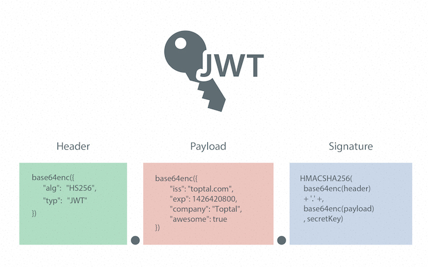
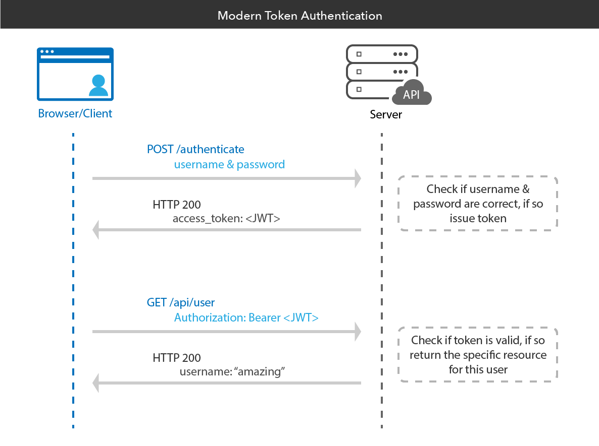

# Définition 

L'authentification par jeton est un moyen d'authentifier les utilisateurs dans une application à l'aide d'un jeton temporaire ( Le Json Web Token) au lieu d'informations d'identification réelles.

# Composition 
Un token JWT est composé de 3 partie : 
- Le _Header_ va contenir les informations sur l'algorithme de cryptage utilisé
- le _Payload_ contiendra toute les informations qu'on souhaiterait lui passé ainsi les timestamp de création et d'expiration
- La _Signature_ reprend le header et le secret, le tout crypter avec l'algorithme définie dans le _Header_




# Fonctionnement




## Pour décrypter le token JWT :
1. Copier le secret définie dans l'application
2. Accéder a :  https://jwt.io/ 
3. Choisir le bon algorithme
4. Saisir le secret
5. Coller le JWT token

# Utilisation du RefreshToken

 Le Jwt token a un date d'expiration assez courte. Le refresh token quand a lui peut a une durée d'expiration bien plus longue. Ce token sera stocker en base de donnée. 
En cas d'authentification avec une JWT token expirée, nous vérifions la présence ou la validité du refresh Token. Si celui ci est correct nous régénérons un JWT token valide. 


# Les méthode pour envoyer le JWT token

- Cookie
- Bearer(dans le header)


# Informations sur l'utilisation du Cookie 

- Le cookie dois être en httpOnly ( modifiable uniquement par le serveur)
- Un Token CSRF dois être ajouter au Payload
- Il sera envoyer en réponse a la requête d'authentification
- Il sera stocker dans la mémoire du navigateur
- Il faudra ajouter a la requête aillant besoin du token : `credentials: "include"`


# Informations sur l'utilisation du bearer

- Le token sera stocker dans une variable suite a la réponse
- Il faudra ensuite ajouté au headers :  ``` 'Authorization': 'Bearer <token>' ```
 

